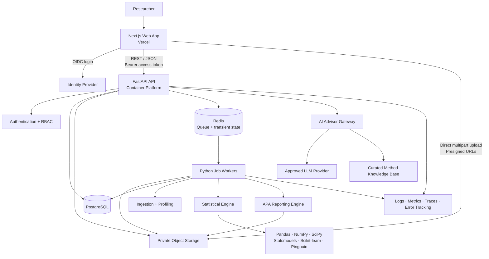
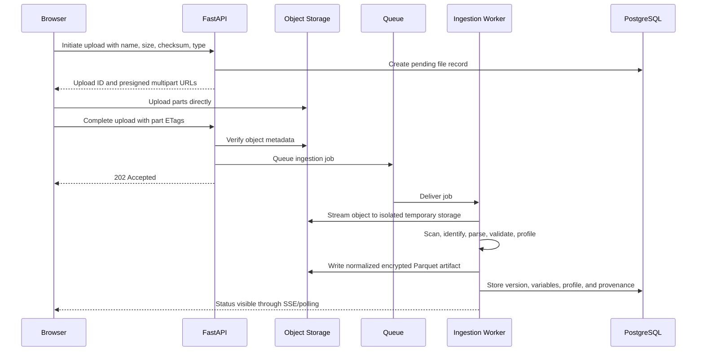
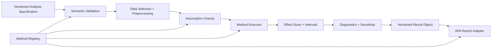
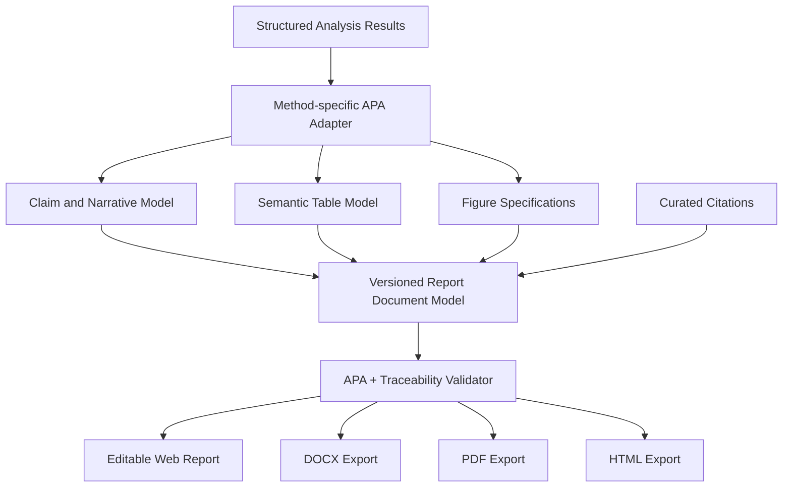
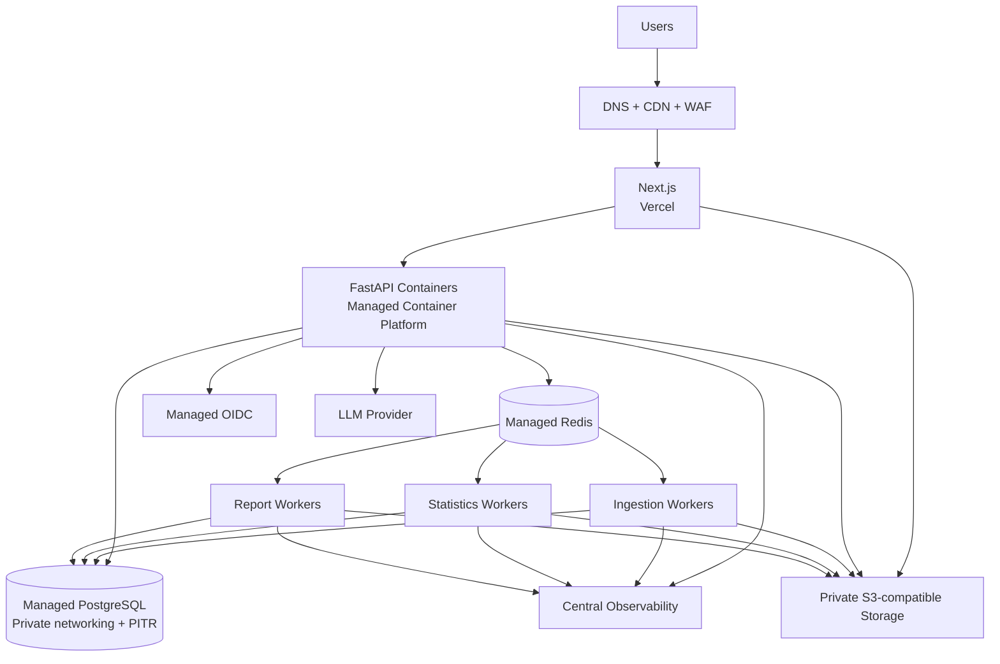

# StatMentor AI — System Architecture

**Status:** Superseded for MVP by [`docs/mvp/MVP_TECHNICAL_SPEC.md`](docs/mvp/MVP_TECHNICAL_SPEC.md)  
**Scope:** Original long-term architecture; retained as a Phase 2 reference  
**Architecture style:** Future-state modular monolith with asynchronous statistical workers

> The approved Version 1 design removes organizations, memberships, billing,
> Redis, worker services, and advanced administration. The canonical MVP schema,
> ERD, API contracts, and folder structure are in the linked MVP specification.

## 1. Product and Architecture Goals

StatMentor AI is a research workspace that helps doctoral researchers upload data, understand its structure, choose defensible statistical methods, execute analyses, inspect assumptions, and generate reproducible APA-style reports.

The architecture prioritizes:

- Methodological correctness and transparent recommendations.
- Reproducibility through immutable dataset versions, analysis specifications, software-version capture, and result provenance.
- Privacy through least-privilege access, short-lived file URLs, encryption, and data retention controls.
- Responsiveness by moving ingestion, profiling, analysis, and report generation to background jobs.
- A simple first production topology that can evolve without an early microservice burden.
- Human review: AI recommendations explain and assist; they do not silently make research decisions.

### Core architectural decisions

| Decision | Choice | Reason |
|---|---|---|
| Initial service shape | Modular FastAPI monolith plus workers | Strong module boundaries with low operational complexity |
| Primary database | PostgreSQL | Relational integrity, JSONB flexibility, mature security and managed hosting |
| Uploaded files | S3-compatible private object storage | Large files do not belong in PostgreSQL or serverless request bodies |
| Job execution | Redis-backed task queue and dedicated Python workers | Statistical jobs can exceed HTTP and serverless time limits |
| Frontend | Next.js App Router on Vercel | Strong authenticated application UX and server-rendered public pages |
| Authentication | Managed OIDC provider with Authorization Code + PKCE | Secure login, MFA, account recovery, and future institutional SSO |
| Analysis model | Declarative, versioned analysis specifications | Auditable, reproducible, and testable execution |
| AI role | Guardrailed orchestration and explanation layer | Prevents the language model from becoming the source of numeric truth |
| Numeric truth | Deterministic Python statistical engine | Results are generated by validated libraries, not by an LLM |

## 2. High-Level Architecture



### Request and job flow

1. The browser authenticates through the identity provider.
2. FastAPI authorizes access based on organization, project membership, and role.
3. The client asks FastAPI to initiate an upload.
4. FastAPI creates an upload record and returns short-lived multipart presigned URLs.
5. The browser uploads directly to private object storage, then confirms completion.
6. FastAPI queues an ingestion job. A worker validates, scans, parses, profiles, and stores a normalized dataset artifact.
7. The researcher creates an analysis plan. The advisor may recommend tests, but the user confirms the final specification.
8. A worker executes deterministic statistical code and stores structured results, diagnostics, figures, warnings, and provenance.
9. The APA engine transforms verified result objects into editable report sections and export files.
10. The UI receives progress through server-sent events, with polling as a fallback.

## 3. Domain Boundaries

The FastAPI application remains one deployable API at first, but its modules must communicate through explicit service interfaces and domain events.

| Module | Responsibility |
|---|---|
| Identity | User profile synchronization and external identity mapping |
| Organizations | Tenant, membership, invitations, and roles |
| Projects | Research workspaces, ownership, settings, and collaborators |
| Files | Upload sessions, object metadata, malware status, and retention |
| Datasets | Dataset versions, variables, labels, missing-value definitions, and profiles |
| Advisor | Research-question intake, method recommendations, explanations, and citations |
| Analyses | Analysis plans, validated specifications, job lifecycle, and result retrieval |
| Statistics | Deterministic computation, assumption checks, effect sizes, and diagnostics |
| Reports | APA sections, tables, figures, references, versioning, and exports |
| Audit | Security and research-provenance events |
| Administration | Usage limits, feature flags, support tooling, and operational controls |

Potential later extractions are worker pools for ingestion, analysis, and document rendering. They should be extracted only when scaling or isolation requirements justify it.

## 4. Repository and Folder Structure

```text
statmentor-ai/
├── apps/
│   ├── web/                         # Next.js application
│   │   ├── app/
│   │   │   ├── (public)/            # Landing, legal, documentation
│   │   │   ├── (auth)/              # Sign-in and auth callbacks
│   │   │   ├── (workspace)/         # Authenticated application routes
│   │   │   │   ├── projects/
│   │   │   │   ├── datasets/
│   │   │   │   ├── analyses/
│   │   │   │   └── reports/
│   │   │   └── api/                 # Next.js-only BFF routes if needed
│   │   ├── components/
│   │   │   ├── ui/
│   │   │   ├── forms/
│   │   │   ├── data-grid/
│   │   │   ├── analysis/
│   │   │   └── reports/
│   │   ├── features/                # Feature-specific UI and state
│   │   ├── lib/                     # API client, auth, validation, formatting
│   │   ├── hooks/
│   │   ├── stores/                  # Minimal client-only state
│   │   ├── styles/
│   │   └── tests/
│   ├── api/                         # FastAPI application
│   │   ├── app/
│   │   │   ├── main/
│   │   │   ├── core/                # Configuration, security, errors, telemetry
│   │   │   ├── api/
│   │   │   │   ├── dependencies/
│   │   │   │   └── v1/
│   │   │   ├── domains/
│   │   │   │   ├── identity/
│   │   │   │   ├── organizations/
│   │   │   │   ├── projects/
│   │   │   │   ├── files/
│   │   │   │   ├── datasets/
│   │   │   │   ├── advisor/
│   │   │   │   ├── analyses/
│   │   │   │   ├── reports/
│   │   │   │   └── audit/
│   │   │   ├── db/                  # Session, base models, migrations
│   │   │   ├── integrations/        # Storage, email, LLM, auth provider
│   │   │   └── tests/
│   │   └── migrations/
│   └── worker/                      # Independently scalable Python workers
│       ├── worker/
│       │   ├── tasks/
│       │   ├── ingestion/
│       │   ├── statistics/
│       │   │   ├── registry/
│       │   │   ├── validators/
│       │   │   ├── assumptions/
│       │   │   ├── executors/
│       │   │   ├── effect_sizes/
│       │   │   ├── diagnostics/
│       │   │   └── serializers/
│       │   ├── reporting/
│       │   │   ├── narrative/
│       │   │   ├── tables/
│       │   │   ├── figures/
│       │   │   ├── citations/
│       │   │   └── exporters/
│       │   └── tests/
├── packages/
│   ├── contracts/                   # OpenAPI-generated TypeScript client/types
│   ├── design-system/               # Shared accessible UI components
│   ├── analysis-spec/               # Versioned JSON Schemas and fixtures
│   └── configuration/               # Shared lint/type/test configuration
├── knowledge/
│   ├── methods/                     # Curated statistical decision rules
│   ├── apa/                         # APA templates and reporting rules
│   └── references/                  # Versioned approved references
├── infrastructure/
│   ├── docker/
│   ├── terraform/                   # Optional production infrastructure
│   ├── vercel/
│   └── monitoring/
├── docs/
│   ├── architecture/
│   ├── api/
│   ├── security/
│   ├── methods/
│   └── adr/                         # Architecture Decision Records
├── scripts/
├── .github/workflows/
└── README.md
```

## 5. PostgreSQL Data Architecture

### Database principles

- UUID primary keys generated by the application or PostgreSQL.
- `timestamptz` for all timestamps.
- Soft deletion only for recoverable user content; immutable audit records are never soft-deleted.
- Every tenant-owned table includes `organization_id`, directly or through an integrity-enforced parent.
- JSONB is used for versioned specifications and heterogeneous statistical results, not as a substitute for core relational entities.
- Dataset files and report exports are stored in object storage; PostgreSQL stores metadata and object keys.
- Row-level security is recommended as defense in depth, while FastAPI remains the primary authorization enforcement point.
- Sensitive logs and audit metadata must not contain raw dataset values.

### Database ERD

```mermaid
erDiagram
    USERS {
        uuid id PK
        text external_subject UK
        citext email
        text display_name
        text status
        timestamptz created_at
        timestamptz last_seen_at
    }

    ORGANIZATIONS {
        uuid id PK
        text name
        text slug UK
        text plan
        jsonb settings
        timestamptz created_at
    }

    MEMBERSHIPS {
        uuid id PK
        uuid organization_id FK
        uuid user_id FK
        text role
        text status
        timestamptz created_at
    }

    PROJECTS {
        uuid id PK
        uuid organization_id FK
        uuid created_by FK
        text title
        text description
        text status
        jsonb research_context
        timestamptz created_at
        timestamptz updated_at
        timestamptz deleted_at
    }

    PROJECT_MEMBERS {
        uuid project_id FK
        uuid user_id FK
        text role
        timestamptz created_at
    }

    FILE_OBJECTS {
        uuid id PK
        uuid organization_id FK
        uuid project_id FK
        uuid uploaded_by FK
        text storage_key UK
        text original_name
        text media_type
        bigint size_bytes
        text sha256
        text upload_status
        text malware_status
        timestamptz created_at
        timestamptz expires_at
    }

    DATASETS {
        uuid id PK
        uuid organization_id FK
        uuid project_id FK
        uuid created_by FK
        text name
        text description
        uuid active_version_id
        timestamptz created_at
        timestamptz deleted_at
    }

    DATASET_VERSIONS {
        uuid id PK
        uuid dataset_id FK
        uuid source_file_id FK
        int version_number
        text status
        text normalized_storage_key
        bigint row_count
        int column_count
        text fingerprint
        jsonb import_options
        jsonb profile_summary
        jsonb software_versions
        timestamptz created_at
    }

    VARIABLES {
        uuid id PK
        uuid dataset_version_id FK
        text source_name
        text display_name
        text storage_name
        text inferred_type
        text measurement_level
        text role
        jsonb value_labels
        jsonb missing_rules
        jsonb profile
        int ordinal_position
    }

    RESEARCH_QUESTIONS {
        uuid id PK
        uuid project_id FK
        uuid created_by FK
        text question_text
        text study_design
        jsonb structured_context
        timestamptz created_at
    }

    ADVISOR_SESSIONS {
        uuid id PK
        uuid project_id FK
        uuid research_question_id FK
        uuid created_by FK
        text status
        jsonb model_config
        timestamptz created_at
    }

    ADVISOR_MESSAGES {
        uuid id PK
        uuid session_id FK
        text role
        text content
        jsonb citations
        jsonb tool_trace
        timestamptz created_at
    }

    ANALYSES {
        uuid id PK
        uuid organization_id FK
        uuid project_id FK
        uuid dataset_version_id FK
        uuid research_question_id FK
        uuid created_by FK
        text name
        text method_key
        text status
        int current_revision
        timestamptz created_at
        timestamptz updated_at
    }

    ANALYSIS_REVISIONS {
        uuid id PK
        uuid analysis_id FK
        int revision_number
        text spec_schema_version
        jsonb specification
        jsonb validation_result
        uuid created_by FK
        timestamptz created_at
    }

    ANALYSIS_RUNS {
        uuid id PK
        uuid analysis_revision_id FK
        uuid requested_by FK
        text status
        text queue_job_id
        text idempotency_key
        jsonb software_versions
        jsonb random_seed
        timestamptz started_at
        timestamptz completed_at
        text failure_code
    }

    ANALYSIS_RESULTS {
        uuid id PK
        uuid analysis_run_id FK
        text result_schema_version
        jsonb summary
        jsonb estimates
        jsonb assumptions
        jsonb diagnostics
        jsonb warnings
        text artifact_storage_prefix
        timestamptz created_at
    }

    REPORTS {
        uuid id PK
        uuid organization_id FK
        uuid project_id FK
        uuid created_by FK
        text title
        text status
        int current_version
        timestamptz created_at
        timestamptz updated_at
    }

    REPORT_VERSIONS {
        uuid id PK
        uuid report_id FK
        int version_number
        jsonb document_model
        jsonb source_run_ids
        text apa_version
        uuid created_by FK
        timestamptz created_at
    }

    REPORT_EXPORTS {
        uuid id PK
        uuid report_version_id FK
        text format
        text status
        text storage_key
        timestamptz created_at
        timestamptz expires_at
    }

    AUDIT_EVENTS {
        uuid id PK
        uuid organization_id FK
        uuid actor_user_id FK
        text action
        text resource_type
        uuid resource_id
        jsonb metadata
        inet ip_address
        timestamptz created_at
    }

    USERS ||--o{ MEMBERSHIPS : has
    ORGANIZATIONS ||--o{ MEMBERSHIPS : contains
    ORGANIZATIONS ||--o{ PROJECTS : owns
    USERS ||--o{ PROJECTS : creates
    PROJECTS ||--o{ PROJECT_MEMBERS : grants
    USERS ||--o{ PROJECT_MEMBERS : joins
    PROJECTS ||--o{ FILE_OBJECTS : stores
    PROJECTS ||--o{ DATASETS : contains
    DATASETS ||--|{ DATASET_VERSIONS : versions
    FILE_OBJECTS ||--o| DATASET_VERSIONS : imports
    DATASET_VERSIONS ||--|{ VARIABLES : describes
    PROJECTS ||--o{ RESEARCH_QUESTIONS : frames
    RESEARCH_QUESTIONS ||--o{ ADVISOR_SESSIONS : informs
    ADVISOR_SESSIONS ||--|{ ADVISOR_MESSAGES : contains
    PROJECTS ||--o{ ANALYSES : contains
    DATASET_VERSIONS ||--o{ ANALYSES : supplies
    RESEARCH_QUESTIONS ||--o{ ANALYSES : motivates
    ANALYSES ||--|{ ANALYSIS_REVISIONS : defines
    ANALYSIS_REVISIONS ||--o{ ANALYSIS_RUNS : executes
    ANALYSIS_RUNS ||--o| ANALYSIS_RESULTS : produces
    PROJECTS ||--o{ REPORTS : contains
    REPORTS ||--|{ REPORT_VERSIONS : versions
    REPORT_VERSIONS ||--o{ REPORT_EXPORTS : exports
    ORGANIZATIONS ||--o{ AUDIT_EVENTS : records
```



### Important constraints and indexes

- Unique membership per `(organization_id, user_id)`.
- Unique project member per `(project_id, user_id)`.
- Unique dataset version per `(dataset_id, version_number)`.
- Unique variable names per `(dataset_version_id, storage_name)`.
- Unique analysis revision per `(analysis_id, revision_number)`.
- Unique report version per `(report_id, version_number)`.
- Partial indexes on active projects, active datasets, queued/running jobs, and unexpired exports.
- B-tree indexes on all foreign keys and common `(organization_id, created_at)` queries.
- GIN indexes only on JSONB fields with demonstrated query requirements.
- Idempotency uniqueness scoped to the requester and operation.

## 6. FastAPI Backend Architecture

### Layering

Each domain module follows the same dependency direction:

```text
API router → application service → domain policy → repository/integration
```

- **Routers** handle HTTP parsing, status codes, and response models.
- **Application services** coordinate use cases and transactions.
- **Domain policies** enforce method-independent business rules and permissions.
- **Repositories** isolate PostgreSQL access.
- **Integrations** isolate object storage, identity, email, queue, and LLM providers.
- **Workers** call the same application/domain interfaces without importing HTTP concerns.

### Backend standards

- FastAPI with Pydantic models and generated OpenAPI 3.1.
- SQLAlchemy 2.x and Alembic migrations.
- Async database access for API request paths; workers may use synchronous sessions where library interoperability is better.
- A transaction per command; read endpoints use explicit query services.
- RFC 9457-style problem responses with stable application error codes.
- Cursor pagination for datasets, analyses, reports, and audit events.
- Idempotency keys for upload completion, analysis runs, and report exports.
- Correlation IDs propagated through API, queue, worker, and logs.
- Structured JSON logs with redaction.
- `/health/live`, `/health/ready`, and a protected operational metrics endpoint.
- API versioning under `/api/v1`; analysis and result schemas carry independent versions.

### Background job states

```text
queued → validating → running → succeeded
                         ├── failed
                         └── cancelled
```

Jobs use at-least-once delivery. Task handlers must therefore be idempotent. Job records are persisted in PostgreSQL; Redis is not the source of truth.

## 7. Next.js Frontend Architecture

### Rendering and state strategy

- App Router with route groups for public, authentication, and workspace areas.
- Server Components for initial page composition and data that does not require browser APIs.
- Client Components only for rich interactions: upload progress, variable mapping, data grids, charts, analysis builders, and report editing.
- A generated TypeScript client from FastAPI OpenAPI to prevent contract drift.
- Server-state cache for request deduplication, mutations, and invalidation.
- URL state for filters, selected tabs, and shareable analysis views.
- Local component state for transient UI; a small global store only for cross-route workflow state.
- Schema-based form validation aligned with backend contracts.

### Primary user journeys

```text
Create project
  → Upload dataset
  → Review import and variable classifications
  → State research question and study design
  → Review recommended methods
  → Configure and validate analysis
  → Run analysis and inspect assumptions
  → Generate/edit APA results
  → Export DOCX/PDF/HTML
```

### Frontend feature areas

- Project dashboard and collaborator management.
- Resumable upload manager with validation and progress.
- Dataset preview, variable dictionary, labels, missing values, and measurement-level editor.
- Research design wizard.
- Advisor conversation with explicit evidence, caveats, and method comparison.
- Analysis builder generated from method metadata.
- Results workspace with estimates, intervals, effect sizes, diagnostics, and warnings.
- APA report editor with traceable links from statements to result fields.
- Accessible tables, keyboard navigation, responsive layout, and WCAG 2.2 AA target.

## 8. API Design

### API conventions

- Base URL: `/api/v1`
- JSON request and response bodies except direct object-storage transfers.
- Resource IDs are UUIDs.
- Dates are ISO 8601 UTC timestamps.
- Mutating requests accept `Idempotency-Key` where retries are plausible.
- Long operations return `202 Accepted` with a job/run resource.
- Access-controlled artifact downloads use short-lived signed URLs.
- SSE endpoint publishes status changes; clients fall back to polling.

### Identity and account

| Method | Endpoint | Purpose |
|---|---|---|
| GET | `/me` | Current profile, memberships, and effective capabilities |
| PATCH | `/me` | Update application profile preferences |
| POST | `/auth/logout` | Revoke application session if a backend session is used |

### Organizations and projects

| Method | Endpoint | Purpose |
|---|---|---|
| GET | `/organizations` | List organizations accessible to the user |
| GET | `/organizations/{organization_id}` | Organization details |
| GET | `/organizations/{organization_id}/members` | List members |
| POST | `/organizations/{organization_id}/invitations` | Invite a member |
| PATCH | `/organizations/{organization_id}/members/{user_id}` | Change member role |
| GET | `/projects` | List accessible projects |
| POST | `/projects` | Create a project |
| GET | `/projects/{project_id}` | Retrieve a project |
| PATCH | `/projects/{project_id}` | Update project metadata |
| DELETE | `/projects/{project_id}` | Soft-delete a project |
| GET | `/projects/{project_id}/members` | List project collaborators |
| PUT | `/projects/{project_id}/members/{user_id}` | Add or update project access |
| DELETE | `/projects/{project_id}/members/{user_id}` | Remove project access |

### Uploads and datasets

| Method | Endpoint | Purpose |
|---|---|---|
| POST | `/projects/{project_id}/uploads` | Validate metadata and initiate multipart upload |
| POST | `/uploads/{upload_id}/parts` | Obtain presigned URLs for one or more parts |
| POST | `/uploads/{upload_id}/complete` | Finalize storage upload and queue ingestion |
| DELETE | `/uploads/{upload_id}` | Abort an incomplete upload |
| GET | `/uploads/{upload_id}` | Upload and ingestion status |
| GET | `/projects/{project_id}/datasets` | List project datasets |
| POST | `/projects/{project_id}/datasets` | Create dataset from a successfully ingested upload |
| GET | `/datasets/{dataset_id}` | Dataset metadata |
| PATCH | `/datasets/{dataset_id}` | Update dataset metadata |
| DELETE | `/datasets/{dataset_id}` | Soft-delete dataset |
| GET | `/datasets/{dataset_id}/versions` | List immutable versions |
| POST | `/datasets/{dataset_id}/versions` | Import a new source file as a version |
| GET | `/dataset-versions/{version_id}` | Version metadata and profile summary |
| GET | `/dataset-versions/{version_id}/variables` | Variable dictionary |
| PATCH | `/dataset-versions/{version_id}/variables/{variable_id}` | Correct display metadata or measurement level |
| GET | `/dataset-versions/{version_id}/preview` | Paginated, access-controlled data preview |
| POST | `/dataset-versions/{version_id}/validate` | Run or rerun data-quality checks |

### Advisor and research design

| Method | Endpoint | Purpose |
|---|---|---|
| POST | `/projects/{project_id}/research-questions` | Create structured research question |
| GET | `/research-questions/{question_id}` | Retrieve question and design context |
| PATCH | `/research-questions/{question_id}` | Update question or design |
| POST | `/projects/{project_id}/advisor-sessions` | Start advisor session |
| GET | `/advisor-sessions/{session_id}` | Session metadata |
| GET | `/advisor-sessions/{session_id}/messages` | Message history |
| POST | `/advisor-sessions/{session_id}/messages` | Add message and request a response |
| POST | `/advisor/recommendations` | Produce ranked method recommendations from structured context |
| GET | `/methods` | List supported statistical methods and capabilities |
| GET | `/methods/{method_key}` | Method requirements, assumptions, parameters, and reporting support |

### Analyses and results

| Method | Endpoint | Purpose |
|---|---|---|
| GET | `/projects/{project_id}/analyses` | List analyses |
| POST | `/projects/{project_id}/analyses` | Create analysis and first specification revision |
| GET | `/analyses/{analysis_id}` | Analysis metadata and current revision |
| PATCH | `/analyses/{analysis_id}` | Rename or archive analysis |
| POST | `/analyses/{analysis_id}/revisions` | Create immutable specification revision |
| POST | `/analysis-revisions/{revision_id}/validate` | Validate variables, design, assumptions, and parameters |
| POST | `/analysis-revisions/{revision_id}/runs` | Queue execution |
| GET | `/analysis-runs/{run_id}` | Run state, progress, and provenance |
| POST | `/analysis-runs/{run_id}/cancel` | Request cancellation |
| GET | `/analysis-runs/{run_id}/results` | Structured statistical results |
| GET | `/analysis-runs/{run_id}/artifacts` | List figures, tables, and diagnostic artifacts |
| GET | `/analysis-runs/{run_id}/artifacts/{artifact_id}/download` | Obtain short-lived download URL |
| GET | `/analysis-runs/{run_id}/events` | SSE progress and state events |

### Reports

| Method | Endpoint | Purpose |
|---|---|---|
| GET | `/projects/{project_id}/reports` | List project reports |
| POST | `/projects/{project_id}/reports` | Create report from selected successful runs |
| GET | `/reports/{report_id}` | Report metadata and current version |
| PATCH | `/reports/{report_id}` | Update report metadata |
| POST | `/reports/{report_id}/versions` | Save an immutable edited document version |
| GET | `/report-versions/{version_id}` | Structured report document |
| POST | `/report-versions/{version_id}/validate` | Check traceability and APA completeness |
| POST | `/report-versions/{version_id}/exports` | Queue DOCX, PDF, or HTML export |
| GET | `/report-exports/{export_id}` | Export status |
| GET | `/report-exports/{export_id}/download` | Obtain short-lived download URL |

### Operational and audit

| Method | Endpoint | Purpose |
|---|---|---|
| GET | `/jobs/{job_id}` | Generic asynchronous job status |
| GET | `/audit-events` | Authorized audit-event search |
| GET | `/health/live` | Process liveness |
| GET | `/health/ready` | Dependency readiness |

## 9. Authentication and Authorization

### Authentication strategy

- Use a managed OIDC provider such as Auth0, Clerk, WorkOS, or an institution-compatible equivalent.
- Browser login uses Authorization Code Flow with PKCE.
- Prefer secure, HTTP-only, `Secure`, `SameSite=Lax` session cookies when the chosen frontend integration supports them.
- If the browser sends access tokens directly to FastAPI, keep tokens in memory rather than local storage and use short expirations with rotating refresh tokens.
- FastAPI validates issuer, audience, signature, expiry, and authorized-party claims using cached JWKS.
- The external identity subject maps to `users.external_subject`; provider profile data is not the authorization source of truth.
- MFA is required for organization owners and administrators and encouraged for all users.
- Future university SSO is supported through OIDC or SAML federation at the identity provider.

### Authorization model

Organization roles:

- **Owner:** billing, organization settings, all projects, role management.
- **Admin:** member and project administration, excluding ownership/billing transfer.
- **Researcher:** create projects and use assigned projects.
- **Viewer:** read-only access to explicitly assigned projects.

Project roles:

- **Project owner:** full project control and deletion.
- **Editor:** upload data, configure/run analyses, edit reports.
- **Viewer:** view datasets, results, and reports; cannot view raw rows unless separately allowed.

Every protected operation checks:

1. Authenticated identity.
2. Active organization membership.
3. Project membership or organization-level privilege.
4. Required capability for the action.
5. Resource belongs to the same organization and project.

PostgreSQL row-level security can enforce tenant isolation with a transaction-local organization/user context. Service roles must not casually bypass RLS.

### Security controls

- TLS everywhere; encryption at rest for database, Redis, and object storage.
- Secrets stored in the deployment platform’s secret manager.
- Strict CORS allowlist between the Vercel application and API.
- CSRF tokens on cookie-authenticated mutating requests.
- Rate limits by user, organization, IP, and expensive operation.
- Content Security Policy, secure headers, dependency scanning, and signed deployment artifacts.
- Raw row previews require an explicit permission and are never sent to the LLM by default.
- Account deletion and configurable data-retention workflows.
- Audit access, upload, download, permission, analysis, export, and deletion events.
- StatMentor must not claim HIPAA, FERPA, IRB, or other regulated-data compliance until separately assessed and implemented.

## 10. File Upload and Ingestion Architecture

### Supported formats

| Format | Extensions | Parser | Important handling |
|---|---|---|---|
| CSV | `.csv`, optionally `.csv.gz` | Pandas | Encoding, delimiter, quote, decimal, header, and type inference |
| Excel | `.xlsx`, `.xls` | Pandas with format-specific engine | Sheet selection, formulas vs cached values, merged headers, date systems |
| SPSS | `.sav`, `.zsav`, `.por` where supported | `pyreadstat` / Pandas integration | Variable labels, value labels, user-defined missing values |
| Stata | `.dta` | `pyreadstat` or Pandas | Value labels, date formats, missing-value semantics |
| RData | `.RData`, `.rda` | `pyreadr` | Multiple objects require explicit dataset selection; supported tabular objects only |

`pyreadstat`, `pyreadr`, Excel engines, and malware-scanning tooling are ingestion dependencies in addition to the six core statistical libraries.

### Upload flow



### Validation and safety

- Enforce configurable file and uncompressed-size limits before and after upload.
- Verify magic bytes and parser-detected format rather than trusting extensions or MIME headers.
- Require SHA-256 checksums and use them for integrity and optional per-tenant duplicate detection.
- Malware scan before parsing; quarantine failed or unknown files.
- Reject password-protected, macro-enabled, executable, malformed, or decompression-bomb content.
- Parse in a resource-limited worker with temporary storage isolation, timeouts, and memory/CPU limits.
- Never execute formulas, macros, embedded scripts, R objects, or arbitrary serialization payloads.
- Sanitize file names and never use them as object-storage paths.
- Formula-injection protections apply to previews and any later CSV/Excel export.

### Normalization and metadata preservation

- Keep the original file immutable for provenance and re-import.
- Convert the selected tabular object/sheet to a typed Parquet artifact for analysis.
- Preserve source column name, safe storage name, display label, value labels, missing-value rules, date/time formats, and source order.
- Create an immutable `dataset_version` fingerprint from source checksum, import options, normalized schema, and parser version.
- Profile missingness, cardinality, numeric ranges, potential identifiers, distributions, and suspicious values.
- Require user confirmation for ambiguous sheet/object selection, headers, date parsing, missing-value conversion, and measurement levels.
- Do not automatically overwrite a dataset version when the researcher corrects metadata; preserve auditable metadata revisions or create a new version when data values change.

## 11. Statistical Engine Architecture

### Fundamental rule

The language model may recommend methods and explain results, but it never calculates or invents statistics. All numeric claims originate in a versioned structured result produced by deterministic Python code.

### Engine pipeline



### Method registry

Every supported method is registered with:

- Stable `method_key` and implementation version.
- Applicable study designs and research-question types.
- Required variable roles and accepted measurement levels.
- Independent/dependent, paired/repeated, grouping, covariate, cluster, and weight requirements.
- Minimum sample and group constraints.
- Parameters and safe defaults.
- Missing-data strategies allowed for that method.
- Assumption checks and decision guidance.
- Executor, result schema, effect-size calculator, diagnostics, and APA adapter.
- References, caveats, known unsupported cases, and validation fixtures.

The analysis specification references variables by immutable variable ID, not display name.

### Library responsibilities

| Library | Primary responsibility |
|---|---|
| Pandas | Tabular selection, reshaping, grouping, missing-data handling, and import interoperability |
| NumPy | Array operations, linear algebra support, deterministic random-number generation |
| SciPy | Probability distributions, hypothesis tests, confidence intervals, and numerical routines |
| Statsmodels | OLS/GLM, ANOVA, repeated measures where suitable, diagnostics, robust covariance, time-series extensions |
| Scikit-learn | Preprocessing pipelines, validation/splitting utilities, predictive models, metrics, and resampling support |
| Pingouin | Research-friendly tests, effect sizes, reliability, correlations, ANOVA/ANCOVA conveniences, and cross-checks |

### Initial method families

Recommended first production scope:

- Descriptive statistics, frequencies, missingness, and confidence intervals.
- Pearson, Spearman, partial correlation, and correlation comparison where supported.
- One-sample, independent, and paired t-tests with nonparametric alternatives.
- One-way and factorial ANOVA, repeated-measures ANOVA where assumptions and implementation permit, ANCOVA, post-hoc comparisons, and multiplicity adjustment.
- Chi-square tests and exact alternatives when applicable.
- Linear and multiple regression with diagnostics and robust standard errors.
- Logistic regression with diagnostics and odds-ratio reporting.
- Reliability analysis such as Cronbach’s alpha and item diagnostics.

Later validated modules:

- Mixed-effects models, generalized estimating equations, survival analysis, mediation/moderation, multivariate methods, power analysis, and predictive modeling.

Each later method requires explicit statistical review and golden-reference tests before exposure.

### Validation stages

1. **Schema validation:** method key, parameter types, and result schema version.
2. **Dataset validation:** referenced version exists and is ready.
3. **Variable validation:** role, data type, measurement level, and cardinality.
4. **Design validation:** independence, pairing, repeated measures, groups, and covariates are coherent.
5. **Data sufficiency:** usable sample size, group sizes, variation, complete cases, and estimability.
6. **Execution validation:** finite outputs, convergence, rank, singularity, separation, and warning capture.
7. **Reporting validation:** every narrative claim resolves to a structured result field.

### Missing data and preprocessing

- Default behavior is explicit, method-appropriate complete-case handling with a reported included/excluded count.
- No hidden imputation.
- Transformations, recoding, filtering, standardization, outlier exclusions, and imputation are first-class specification steps.
- Every preprocessing step records parameters, affected rows, before/after counts, and warnings.
- Advanced imputation should be a separately validated future module.

### Reproducibility and quality

- Capture dataset fingerprint, analysis specification, library/container versions, locale, time zone, random seed, and execution timestamps.
- Pin production dependencies and container images.
- Keep successful result objects immutable; reruns create new run records.
- Unit tests for formulas and edge cases.
- Property-based tests for invariants.
- Golden tests against trusted R/SPSS/Stata fixtures and published examples.
- Cross-library agreement checks where independent implementations exist.
- Statistical expert review and sign-off per method family.
- Warnings are structured and visible; they are never silently discarded.

## 12. AI Advisor Architecture

The advisor is separated from the numeric engine and uses a constrained workflow:

1. Collect structured research design facts.
2. Read dataset metadata and aggregate profiles, not raw rows by default.
3. Retrieve method rules and approved references from the curated knowledge base.
4. Produce ranked candidate methods with prerequisites, assumptions, trade-offs, and disqualifiers.
5. Ask for missing design information when recommendations would otherwise be unsafe.
6. Emit a structured recommendation object validated by the backend.
7. Require user confirmation before creating an analysis specification.

Protections:

- Treat dataset text and uploaded metadata as untrusted input.
- Tool allowlists; the model cannot issue arbitrary Python or database commands.
- Structured output schemas with rejection/retry on invalid output.
- Provider prompts and outputs are logged only under an explicit privacy policy and with sensitive-value redaction.
- Configurable provider data-retention settings and a no-LLM mode for privacy-sensitive organizations.
- Citations point to curated, versioned references rather than model memory.
- Recommendations include uncertainty and clearly distinguish guidance from executed evidence.

## 13. APA Reporting Engine Architecture

### Reporting pipeline



### Design principles

- The canonical artifact is a structured report document model, not generated prose or HTML.
- Each quantitative claim stores a source pointer such as analysis run, result path, formatting rule, and generation version.
- Method-specific adapters decide which statistics are reportable and how they are labeled.
- Deterministic templates generate the first narrative. An LLM may improve readability only while locked numeric tokens remain machine-controlled.
- User edits create report versions; generated content is never silently replaced.
- Reports distinguish prespecified analyses from exploratory analyses when the project records that information.

### Formatting layer

- APA edition is explicit and versioned.
- Central formatting functions cover decimal precision, leading zeros, exact versus threshold p-values, confidence intervals, effect sizes, test symbols, degrees of freedom, and missing values.
- Tables are semantic structures with titles, notes, headers, stub columns, body cells, and source links.
- Figures are produced from stored specifications with consistent fonts, accessible colors, dimensions, captions, and alt text.
- Report validation checks required statistics, unresolved warnings, claim traceability, table/figure numbering, references, and stale source runs.

### Export strategy

- Web editing uses the canonical document model.
- DOCX is the primary editable academic export.
- PDF is rendered in a controlled worker from the canonical model or DOCX/HTML pipeline and visually regression-tested.
- HTML supports accessible sharing and preview.
- Every export records report version, generator version, template version, and source analysis runs.

## 14. Deployment Architecture

### Production topology



### Component placement

| Component | Recommended placement |
|---|---|
| Next.js | Vercel production and preview deployments |
| FastAPI | Long-running container platform such as AWS ECS/Fargate, Google Cloud Run, Azure Container Apps, Render, Fly.io, or Railway |
| Workers | Same region and container platform as FastAPI, with separate autoscaling pools |
| PostgreSQL | Managed PostgreSQL in the same region as API/workers, private connectivity, point-in-time recovery |
| Redis | Managed Redis in the same region, private connectivity |
| Object storage | Private regional bucket with lifecycle policies and CORS restricted to application origins |
| Identity | Managed OIDC provider |
| Observability | OpenTelemetry-compatible traces/metrics plus centralized logs and error tracking |

Vercel must not run statistical analysis jobs. Its role is the Next.js application and optional lightweight frontend-specific endpoints.

### Environments

- **Local:** Docker-based dependencies, local object-storage emulator, synthetic datasets.
- **Preview:** Vercel preview plus a shared or ephemeral API environment; synthetic data only.
- **Staging:** Production-like isolated database, storage, queue, identity tenant, and workers.
- **Production:** Separate account/project, private data services, strict access control, backups, and monitored SLOs.

Environment data must never be copied downward without an approved anonymization process.

### Networking and operations

- API and workers are in one region; PostgreSQL, Redis, and object storage are colocated.
- Public ingress reaches only Vercel and the FastAPI load balancer.
- Database and Redis have no public ingress.
- Separate worker queues and autoscaling limits prevent report rendering or large imports from starving interactive jobs.
- Deploy database migrations as an explicit release step before compatible application rollout.
- Use backward-compatible expand/migrate/contract migrations.
- Daily backups plus point-in-time recovery; periodic restore drills.
- Object versioning or soft-delete protection for critical artifacts, followed by retention lifecycle deletion.
- Graceful worker shutdown and job visibility timeouts prevent abandoned jobs.

### CI/CD gates

1. Formatting, linting, type checks, and unit tests.
2. API contract compatibility checks.
3. Migration safety checks.
4. Statistical golden and regression tests.
5. Dependency, secret, container, and infrastructure scans.
6. Build immutable frontend and container artifacts.
7. Deploy preview/staging and run integration/e2e tests.
8. Manual production approval initially.
9. Post-deploy smoke tests and automatic rollback for service health failures.

### Initial service objectives

- API availability target: 99.9% after production stabilization.
- Typical metadata API p95: under 500 ms, excluding long-running jobs.
- Job queue delay and execution duration tracked separately by method and dataset size.
- Recovery-point and recovery-time objectives must be agreed before handling real research data.

## 15. Cross-Cutting Concerns

### Privacy and data governance

- Data classification: account data, research metadata, raw research data, derived artifacts, and audit data.
- Organization-configurable retention; deletion cascades through database records and object-storage lifecycle jobs.
- Export and deletion requests are auditable.
- Support region-specific hosting only when product requirements justify the operational complexity.
- Publish clear terms that researchers remain responsible for ethical approval, participant privacy, design decisions, and interpretation.

### Observability

- Metrics: request latency/errors, database pool saturation, queue depth, job durations, parser failures, analysis warnings, report failures, storage usage, and LLM latency/cost.
- Distributed traces link browser request IDs, API actions, queue jobs, and workers.
- Logs use identifiers and aggregate metadata, never raw dataset values.
- Alerts cover availability, elevated failures, stuck queues, backup failures, storage anomalies, and security events.

### Usage controls

- Per-plan limits for storage, file size, monthly analysis runs, concurrency, collaborators, and LLM use.
- Enforce limits in application services before allocating expensive resources.
- Record usage in append-only metering events or a dedicated usage table once billing is introduced.

## 16. Development Roadmap

### Phase 0 — Architecture and research-method governance

- Approve this architecture and record major decisions as ADRs.
- Define MVP method list, supported study designs, file-size targets, privacy posture, and deployment provider.
- Establish statistical review process and trusted comparison datasets.
- Define versioned analysis and result schemas.

**Exit:** Architecture, security baseline, method acceptance criteria, and product scope approved.

### Phase 1 — Platform foundation

- Monorepo, CI/CD, environments, configuration, observability, and migration framework.
- OIDC authentication, organizations, roles, projects, and audit events.
- PostgreSQL, Redis, object storage, and worker connectivity.
- Generated API client and frontend application shell.

**Exit:** Authenticated user can create and access an authorized project in staging.

### Phase 2 — Secure ingestion and dataset understanding

- Multipart uploads, checksums, malware quarantine, format detection, and limits.
- CSV and Excel import first; SPSS, Stata, and RData follow behind format-specific tests.
- Immutable dataset versions, Parquet normalization, variable dictionary, profiling, preview, and metadata correction.
- Upload and ingestion progress UI.

**Exit:** Supported files become reproducible, profiled dataset versions with preserved metadata.

### Phase 3 — Statistical engine MVP

- Method registry, specification validation, execution framework, provenance, and structured warnings.
- Descriptives, correlations, t-tests, one-way ANOVA, chi-square, and linear regression.
- Assumption checks, confidence intervals, effect sizes, diagnostics, and multiplicity correction.
- Golden tests against trusted reference outputs.

**Exit:** Approved methods produce expert-reviewed, reproducible structured results.

### Phase 4 — Guided advisor

- Research-question and study-design wizard.
- Curated method knowledge base and retrieval.
- Ranked recommendations with disqualifiers, assumptions, alternatives, and citations.
- Structured recommendation-to-analysis handoff with required user confirmation.

**Exit:** Advisor recommendations are traceable, schema-valid, and cannot bypass engine validation.

### Phase 5 — APA reporting

- Method adapters, deterministic narrative templates, APA formatter, semantic tables, and figures.
- Traceable report model and versioned web editor.
- DOCX, PDF, and HTML exporters with visual regression tests.
- Optional constrained prose refinement.

**Exit:** Successful runs generate editable, traceable, expert-reviewed APA-style reports.

### Phase 6 — Collaboration and production hardening

- Invitations, project sharing, comments or review workflow, retention controls, and account deletion.
- Load tests, restore drills, security review, accessibility audit, cost controls, and incident runbooks.
- Production SLO dashboards and support tooling.

**Exit:** Product is ready for controlled production use with real research datasets.

### Phase 7 — Advanced methods

- Add methods only through the registry, validation, reference fixtures, statistical review, documentation, and APA adapter process.
- Candidate areas: logistic models, mixed models, repeated measures, reliability, mediation/moderation, power, survival, and predictive workflows.

**Exit:** Each method family independently meets the same correctness and reporting gates as the MVP.

## 17. Decisions Required Before Implementation

Approval should explicitly settle:

1. MVP statistical method families and exclusions.
2. Maximum file size, row count, column count, and job duration targets.
3. Whether organizations and collaboration are required in the first release.
4. Identity provider and requirements for university SSO.
5. Production container, PostgreSQL, Redis, and object-storage providers.
6. LLM provider, data-retention posture, and whether a no-LLM mode is required.
7. Required report formats: DOCX is recommended first, followed by PDF and HTML.
8. Target APA edition and institutional template customization requirements.
9. Data-retention defaults and whether regulated or highly sensitive data is prohibited at launch.
10. Statistical expert review ownership and acceptance process.

## 18. Recommended Approval Baseline

For a disciplined MVP, approve:

- Modular monolith API plus three worker queues.
- Managed OIDC, PostgreSQL, Redis, and S3-compatible storage.
- CSV, Excel, SPSS, Stata, and RData ingestion, introduced in that testing order.
- Descriptives, correlation, t-tests, one-way ANOVA, chi-square, and linear regression.
- Deterministic APA reporting with DOCX first.
- Advisor access to metadata and aggregate profiles only, with no raw-row access by default.
- Explicit prohibition of regulated data until a separate compliance assessment is complete.

No application implementation should begin until this architecture and the decisions above are approved or amended.
