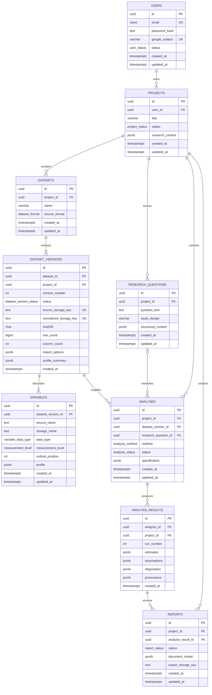

# StatMentor AI — Final MVP Technical Specification

**Status:** Final design for implementation approval  
**Scope:** Database schema, ERD, migration plan, API contracts, and project structure  
**Not in this document:** Frontend or backend implementation code  

## 1. Approved MVP Boundaries

The MVP is a single-owner research application:

- Every project belongs to exactly one user.
- There are no organizations, memberships, collaborators, billing records, or administration modules.
- FastAPI performs uploads, profiling, analysis, and report generation in-process.
- There is no Redis, task queue, or worker deployment in Version 1.
- CSV and Excel are the only accepted source formats.
- The statistical engine supports only:
  - Descriptive Statistics
  - Pearson Correlation
  - Spearman Correlation
  - Independent Samples t-test
  - One-Way ANOVA
  - Linear Regression
  - Cronbach Alpha
- SPSS, Stata, RData, Redis workers, SEM, CFA, PLS-SEM, and other advanced methods are Phase 2.

### Synchronous execution rule

Uploads and analyses execute within FastAPI request handling in the MVP. To keep
this safe:

- Enforce a conservative upload size and row limit.
- Apply request and computation timeouts.
- Reject work that exceeds MVP limits with `413 DATASET_TOO_LARGE` or
  `422 ANALYSIS_LIMIT_EXCEEDED`.
- Persist a failed status and structured error when processing begins but fails.
- Add worker queues in Phase 2 without changing the analysis specification or
  result contracts.

## 2. Final PostgreSQL Schema

### Database conventions

- PostgreSQL 15 or newer.
- UUID primary keys generated by `gen_random_uuid()`.
- Case-insensitive unique email addresses through `citext`.
- UTC-aware `timestamptz` timestamps.
- Files live in private object storage; PostgreSQL stores object keys and metadata.
- JSONB stores method-specific specifications and results.
- All authorization is owner-based and enforced by FastAPI.
- Dataset versions and successful analysis results are immutable.
- `updated_at` is maintained by a database trigger on mutable tables.

### Tables

#### `users`

Application identity used by NextAuth.

| Column | Type | Rules |
|---|---|---|
| `id` | UUID | Primary key |
| `email` | CITEXT | Required, unique |
| `name` | VARCHAR(200) | Required |
| `image_url` | TEXT | Optional |
| `password_hash` | TEXT | Optional; Argon2id hash only |
| `google_subject` | VARCHAR(255) | Optional, unique |
| `email_verified_at` | TIMESTAMPTZ | Optional |
| `status` | `user_status` | `active`, `disabled`, `deleted` |
| `last_login_at` | TIMESTAMPTZ | Optional |
| `created_at` | TIMESTAMPTZ | Required |
| `updated_at` | TIMESTAMPTZ | Required |

At least one of `password_hash` or `google_subject` must exist. NextAuth uses JWT
sessions, so no database session or OAuth account tables are needed in the MVP.

#### `projects`

Top-level user-owned research workspace.

| Column | Type | Rules |
|---|---|---|
| `id` | UUID | Primary key |
| `user_id` | UUID | Required FK → `users.id` |
| `title` | VARCHAR(250) | Required |
| `description` | TEXT | Optional |
| `research_context` | JSONB | Required object, default `{}` |
| `status` | `project_status` | `active`, `archived` |
| `created_at` | TIMESTAMPTZ | Required |
| `updated_at` | TIMESTAMPTZ | Required |

Deleting a user cascades through all owned research records. Normal product
behavior should archive projects rather than delete them.

#### `datasets`

Logical dataset within a project.

| Column | Type | Rules |
|---|---|---|
| `id` | UUID | Primary key |
| `project_id` | UUID | Required FK → `projects.id` |
| `name` | VARCHAR(250) | Required |
| `description` | TEXT | Optional |
| `source_format` | `dataset_format` | `csv` or `excel` |
| `created_at` | TIMESTAMPTZ | Required |
| `updated_at` | TIMESTAMPTZ | Required |

Dataset names are unique within a project, case-insensitively.

#### `dataset_versions`

Immutable imported version and its reproducibility metadata.

| Column | Type | Rules |
|---|---|---|
| `id` | UUID | Primary key |
| `dataset_id` | UUID | Required FK → `datasets.id` |
| `project_id` | UUID | Required; integrity FK keeps version in dataset’s project |
| `version_number` | INTEGER | Required, positive |
| `status` | `dataset_version_status` | `processing`, `ready`, `failed` |
| `original_filename` | VARCHAR(500) | Required, display only |
| `media_type` | VARCHAR(150) | Required |
| `source_storage_key` | TEXT | Required, unique |
| `normalized_storage_key` | TEXT | Optional, unique |
| `file_size_bytes` | BIGINT | Required, nonnegative |
| `sha256` | CHAR(64) | Required lowercase hex |
| `row_count` | BIGINT | Optional, nonnegative |
| `column_count` | INTEGER | Optional, positive |
| `import_options` | JSONB | Required object |
| `profile_summary` | JSONB | Required object |
| `software_versions` | JSONB | Required object |
| `error_code` | VARCHAR(100) | Optional |
| `error_message` | TEXT | Optional, sanitized |
| `created_at` | TIMESTAMPTZ | Required |

`ready` versions require row count, column count, and a normalized storage key.
`failed` versions require an error code.

#### `variables`

Variable dictionary for one immutable dataset version.

| Column | Type | Rules |
|---|---|---|
| `id` | UUID | Primary key |
| `dataset_version_id` | UUID | Required FK → `dataset_versions.id` |
| `source_name` | TEXT | Required |
| `storage_name` | TEXT | Required |
| `display_name` | TEXT | Required |
| `data_type` | `variable_data_type` | `integer`, `float`, `boolean`, `string`, `date`, `datetime` |
| `measurement_level` | `measurement_level` | `nominal`, `ordinal`, `scale`, `unknown` |
| `ordinal_position` | INTEGER | Required, nonnegative |
| `value_labels` | JSONB | Required object |
| `missing_rules` | JSONB | Required object |
| `profile` | JSONB | Required object |
| `created_at` | TIMESTAMPTZ | Required |
| `updated_at` | TIMESTAMPTZ | Required |

Storage names and positions are unique within a dataset version. User corrections
may change `display_name` and `measurement_level`; raw data remains immutable.

#### `research_questions`

Structured research question and study-design context.

| Column | Type | Rules |
|---|---|---|
| `id` | UUID | Primary key |
| `project_id` | UUID | Required FK → `projects.id` |
| `question_text` | TEXT | Required |
| `study_design` | VARCHAR(100) | Optional |
| `structured_context` | JSONB | Required object |
| `created_at` | TIMESTAMPTZ | Required |
| `updated_at` | TIMESTAMPTZ | Required |

#### `analyses`

An analysis specification and execution lifecycle.

| Column | Type | Rules |
|---|---|---|
| `id` | UUID | Primary key |
| `project_id` | UUID | Required FK → `projects.id` |
| `dataset_version_id` | UUID | Required FK → `dataset_versions.id` |
| `research_question_id` | UUID | Optional FK → `research_questions.id` |
| `name` | VARCHAR(250) | Required |
| `method` | `analysis_method` | One of the seven approved methods |
| `status` | `analysis_status` | `draft`, `running`, `completed`, `failed` |
| `specification` | JSONB | Required object |
| `spec_schema_version` | VARCHAR(20) | Required, default `1.0` |
| `software_versions` | JSONB | Required object |
| `started_at` | TIMESTAMPTZ | Optional |
| `completed_at` | TIMESTAMPTZ | Optional |
| `error_code` | VARCHAR(100) | Optional |
| `error_message` | TEXT | Optional, sanitized |
| `created_at` | TIMESTAMPTZ | Required |
| `updated_at` | TIMESTAMPTZ | Required |

The database enforces that the selected dataset version and optional research
question belong to the same project as the analysis.

#### `analysis_results`

Immutable successful output for an analysis. An analysis can be rerun, producing
multiple numbered results.

| Column | Type | Rules |
|---|---|---|
| `id` | UUID | Primary key |
| `analysis_id` | UUID | Required FK → `analyses.id` |
| `project_id` | UUID | Required; integrity FK keeps result in analysis project |
| `run_number` | INTEGER | Required, positive |
| `result_schema_version` | VARCHAR(20) | Required, default `1.0` |
| `sample_summary` | JSONB | Required object |
| `estimates` | JSONB | Required object |
| `assumptions` | JSONB | Required object |
| `diagnostics` | JSONB | Required object |
| `warnings` | JSONB | Required array |
| `apa_narrative` | TEXT | Optional |
| `tables` | JSONB | Required array |
| `figures` | JSONB | Required array |
| `provenance` | JSONB | Required object |
| `created_at` | TIMESTAMPTZ | Required |

#### `reports`

Editable APA report generated from one analysis result.

| Column | Type | Rules |
|---|---|---|
| `id` | UUID | Primary key |
| `project_id` | UUID | Required FK → `projects.id` |
| `analysis_result_id` | UUID | Required FK → `analysis_results.id` |
| `title` | VARCHAR(250) | Required |
| `status` | `report_status` | `draft`, `final` |
| `apa_version` | VARCHAR(20) | Required, default `7` |
| `document_model` | JSONB | Required object |
| `export_storage_key` | TEXT | Optional |
| `created_at` | TIMESTAMPTZ | Required |
| `updated_at` | TIMESTAMPTZ | Required |

The database enforces that the source analysis result belongs to the report’s
project. One result can have multiple report drafts if desired.

## 3. Database ERD



## 4. Authentication Contract

NextAuth is hosted by Next.js and uses:

- Google OAuth provider.
- Credentials provider for email/password.
- JWT session strategy.
- Secure, HTTP-only cookies.
- A stable application `user.id` included in the signed JWT and session.

### Account linking

- Google sign-in first looks up `google_subject`.
- If absent, it may link to an existing user with the same verified email only
  after NextAuth confirms the Google email is verified.
- Credentials sign-in requires `password_hash` and an active user.
- Passwords are hashed with Argon2id in the FastAPI identity endpoint or a
  narrowly scoped Next.js auth service; plaintext passwords are never stored.
- Adding password login to a Google-only account requires a verified, expiring
  set-password flow in implementation.

### FastAPI authentication

The Next.js application sends a short-lived signed application token to FastAPI.
FastAPI validates its signature, issuer, audience, expiry, and `sub=user.id`.
Every resource query is scoped through the authenticated user:

```text
resource → project → projects.user_id = authenticated user ID
```

The browser must not be allowed to assert a user ID in request bodies.

## 5. API Endpoint Contracts

### Global conventions

- Base path: `/api/v1`
- Content type: `application/json`, except dataset upload requests.
- IDs: UUID strings.
- Timestamps: ISO 8601 UTC.
- Authentication: `Authorization: Bearer <application-token>`.
- All list responses use:

```json
{
  "items": [],
  "page": 1,
  "page_size": 20,
  "total": 0
}
```

- Errors use:

```json
{
  "type": "https://statmentor.ai/problems/validation-error",
  "title": "Validation failed",
  "status": 422,
  "code": "VALIDATION_ERROR",
  "detail": "One or more fields are invalid.",
  "errors": [
    {"field": "specification.variables", "message": "At least two variables are required."}
  ],
  "request_id": "uuid"
}
```

- Ownership failures return `404`, avoiding disclosure that another user’s
  resource exists.
- Mutation endpoints reject archived projects with `409 PROJECT_ARCHIVED`.

### Identity

#### `POST /auth/register`

Creates an email/password user.

Request:

```json
{"email": "researcher@example.edu", "password": "secret", "name": "A. Researcher"}
```

Response `201`: public user object.  
Errors: `409 EMAIL_ALREADY_EXISTS`, `422 PASSWORD_POLICY_FAILED`.

#### `GET /me`

Response `200`:

```json
{
  "id": "uuid",
  "email": "researcher@example.edu",
  "name": "A. Researcher",
  "image_url": null,
  "email_verified_at": null,
  "auth_methods": ["password"]
}
```

#### `PATCH /me`

Updates `name` and `image_url`. Response `200`: updated public user.

### Projects

| Method | Path | Success | Contract |
|---|---|---:|---|
| GET | `/projects` | 200 | Paginated owned projects; filters: `status`, `search`, `page`, `page_size` |
| POST | `/projects` | 201 | Body: `title`, optional `description`, optional `research_context` |
| GET | `/projects/{project_id}` | 200 | Owned project detail plus resource counts |
| PATCH | `/projects/{project_id}` | 200 | Partial `title`, `description`, `research_context`, or `status` |
| DELETE | `/projects/{project_id}` | 204 | Permanently deletes project and descendants after confirmation |

Create request:

```json
{
  "title": "Dissertation Study",
  "description": "Predictors of doctoral persistence",
  "research_context": {"discipline": "education"}
}
```

### Datasets and versions

| Method | Path | Success | Contract |
|---|---|---:|---|
| GET | `/projects/{project_id}/datasets` | 200 | Paginated datasets owned through project |
| POST | `/projects/{project_id}/datasets` | 201 | Multipart upload: `file`, `name`, optional `description`, `import_options` JSON |
| GET | `/datasets/{dataset_id}` | 200 | Dataset metadata and latest ready version summary |
| PATCH | `/datasets/{dataset_id}` | 200 | Partial `name` or `description` |
| DELETE | `/datasets/{dataset_id}` | 204 | Deletes dataset, versions, variables, dependent analyses/results/reports, and schedules object deletion |
| GET | `/datasets/{dataset_id}/versions` | 200 | Paginated version metadata |
| POST | `/datasets/{dataset_id}/versions` | 201 | Multipart new version: `file`, `import_options` JSON |
| GET | `/dataset-versions/{version_id}` | 200 | Import status, dimensions, profile, provenance |
| GET | `/dataset-versions/{version_id}/variables` | 200 | Ordered variable dictionary |
| GET | `/dataset-versions/{version_id}/preview` | 200 | Query: `offset`, `limit` capped at 100; returns columns and rows |
| PATCH | `/variables/{variable_id}` | 200 | Partial `display_name` or `measurement_level` |

Supported multipart file types:

- `.csv` with `text/csv` or compatible detected text format.
- `.xlsx` with the Open XML workbook media type.
- `.xls` only if the approved Excel parser is installed and sandboxed; otherwise
  return `415 UNSUPPORTED_FILE_FORMAT`.

`import_options`:

```json
{
  "sheet_name": "Sheet1",
  "header_row": 0,
  "delimiter": ",",
  "encoding": "utf-8",
  "decimal": ".",
  "missing_values": ["", "NA", "N/A"]
}
```

Only options relevant to the detected format are accepted. Successful upload
returns the dataset and completed ready version because MVP processing is
synchronous. A processing failure returns an error and preserves a failed
version record when possible.

### Research questions

| Method | Path | Success | Contract |
|---|---|---:|---|
| GET | `/projects/{project_id}/research-questions` | 200 | Paginated project questions |
| POST | `/projects/{project_id}/research-questions` | 201 | Body: `question_text`, optional `study_design`, `structured_context` |
| GET | `/research-questions/{question_id}` | 200 | Question detail |
| PATCH | `/research-questions/{question_id}` | 200 | Partial question fields |
| DELETE | `/research-questions/{question_id}` | 204 | Deletes question; existing analyses retain a null question reference |

### Methods metadata

#### `GET /methods`

Returns the seven enabled methods and their input requirements.

#### `GET /methods/{method}`

Returns method metadata:

```json
{
  "key": "pearson_correlation",
  "label": "Pearson Correlation",
  "spec_schema_version": "1.0",
  "variable_roles": [
    {"key": "variables", "minimum": 2, "measurement_levels": ["scale"]}
  ],
  "parameters": {},
  "assumptions": ["linearity", "bivariate_normality", "independent_observations"],
  "supported_reports": ["apa_narrative", "correlation_table"]
}
```

Unknown or Phase 2 methods return `404 METHOD_NOT_AVAILABLE`.

### Analyses

| Method | Path | Success | Contract |
|---|---|---:|---|
| GET | `/projects/{project_id}/analyses` | 200 | Paginated analyses; filters: `method`, `status` |
| POST | `/projects/{project_id}/analyses` | 201 | Creates validated draft analysis |
| GET | `/analyses/{analysis_id}` | 200 | Analysis specification, status, and latest result summary |
| PATCH | `/analyses/{analysis_id}` | 200 | Updates draft `name`, `research_question_id`, or `specification` |
| DELETE | `/analyses/{analysis_id}` | 204 | Deletes analysis, results, and dependent reports |
| POST | `/analyses/{analysis_id}/validate` | 200 | Returns validation, assumption plan, and warnings without execution |
| POST | `/analyses/{analysis_id}/run` | 201 | Executes synchronously and returns completed result |
| GET | `/analyses/{analysis_id}/results` | 200 | Paginated immutable run results |
| GET | `/analysis-results/{result_id}` | 200 | Complete structured result |

Create request:

```json
{
  "dataset_version_id": "uuid",
  "research_question_id": "uuid-or-null",
  "name": "Relationship between support and persistence",
  "method": "pearson_correlation",
  "specification": {
    "variables": ["variable-uuid-1", "variable-uuid-2"],
    "missing_data": "listwise",
    "confidence_level": 0.95
  }
}
```

Run behavior:

1. Lock the analysis row.
2. Validate ownership, ready dataset status, variable IDs, measurement levels,
   method specification, and MVP resource limits.
3. Set status to `running`.
4. Execute deterministic statistical code.
5. Insert immutable `analysis_results` with the next `run_number`.
6. Set analysis status to `completed`.
7. On failure, set status to `failed` and return a structured error.

Repeated calls create distinct numbered results. Clients should present an
explicit rerun confirmation.

### Method specification contracts

All specifications allow:

```json
{"missing_data": "listwise", "confidence_level": 0.95}
```

MVP supports listwise deletion only. Confidence level is greater than `0.50`
and less than `1.00`, defaulting to `0.95`.

| Method key | Required specification |
|---|---|
| `descriptive_statistics` | `variables: UUID[1..N]`; optional `statistics` subset |
| `pearson_correlation` | `variables: UUID[2..N]` |
| `spearman_correlation` | `variables: UUID[2..N]` |
| `independent_t_test` | `dependent_variable: UUID`, `grouping_variable: UUID`, `group_values: [value, value]`, optional `equal_variances: boolean` |
| `one_way_anova` | `dependent_variable: UUID`, `factor_variable: UUID`, optional `post_hoc: "tukey" | "none"` |
| `linear_regression` | `dependent_variable: UUID`, `predictors: UUID[1..N]`, optional `include_intercept: boolean` |
| `cronbach_alpha` | `items: UUID[2..N]`, optional `reverse_scored_items: UUID[]` |

Variable IDs must belong to the selected dataset version. Method-specific
validators enforce measurement levels, group count, sample size, variance,
rank, and other estimability requirements.

### Reports

| Method | Path | Success | Contract |
|---|---|---:|---|
| GET | `/projects/{project_id}/reports` | 200 | Paginated reports; filters: `status` |
| POST | `/projects/{project_id}/reports` | 201 | Generates report synchronously from `analysis_result_id` |
| GET | `/reports/{report_id}` | 200 | Report metadata and document model |
| PATCH | `/reports/{report_id}` | 200 | Updates `title`, `status`, or validated `document_model` |
| DELETE | `/reports/{report_id}` | 204 | Deletes report and associated export object |
| POST | `/reports/{report_id}/export` | 200 | Body: `format`; returns short-lived download URL |

Create request:

```json
{
  "analysis_result_id": "uuid",
  "title": "Results: Predictor Analysis",
  "apa_version": "7"
}
```

Export request:

```json
{"format": "docx"}
```

MVP should implement DOCX first. PDF may be enabled only after its renderer and
visual verification are ready. Unsupported formats return `422
EXPORT_FORMAT_NOT_AVAILABLE`.

### Health

| Method | Path | Success | Contract |
|---|---|---:|---|
| GET | `/health/live` | 200 | Process is alive; no authentication |
| GET | `/health/ready` | 200/503 | Database and required storage are reachable |

## 6. Response Resource Shapes

### Dataset version

```json
{
  "id": "uuid",
  "dataset_id": "uuid",
  "version_number": 1,
  "status": "ready",
  "original_filename": "study.xlsx",
  "source_format": "excel",
  "row_count": 427,
  "column_count": 18,
  "profile_summary": {},
  "created_at": "2026-06-20T14:30:00Z"
}
```

Storage keys, password hashes, internal parser paths, stack traces, and provider
subjects are never returned by general API resource serializers.

### Analysis result

```json
{
  "id": "uuid",
  "analysis_id": "uuid",
  "run_number": 1,
  "result_schema_version": "1.0",
  "sample_summary": {
    "total_rows": 427,
    "included_rows": 401,
    "excluded_rows": 26
  },
  "estimates": {},
  "assumptions": {},
  "diagnostics": {},
  "warnings": [],
  "apa_narrative": "A Pearson correlation was conducted...",
  "tables": [],
  "figures": [],
  "provenance": {
    "dataset_version_id": "uuid",
    "dataset_sha256": "hex",
    "analysis_method": "pearson_correlation",
    "analysis_specification": {},
    "software_versions": {}
  },
  "created_at": "2026-06-20T14:35:00Z"
}
```

## 7. Final Project Folder Structure

This is the intended implementation layout; only documentation and migrations
exist at the current approval stage.

```text
statmentor-ai/
├── apps/
│   ├── web/                              # Next.js App Router
│   │   ├── app/
│   │   │   ├── (public)/
│   │   │   ├── (auth)/
│   │   │   ├── (workspace)/
│   │   │   │   ├── projects/
│   │   │   │   ├── datasets/
│   │   │   │   ├── analyses/
│   │   │   │   └── reports/
│   │   │   └── api/
│   │   │       └── auth/[...nextauth]/   # NextAuth route only
│   │   ├── components/
│   │   ├── features/
│   │   │   ├── projects/
│   │   │   ├── datasets/
│   │   │   ├── research-questions/
│   │   │   ├── analyses/
│   │   │   └── reports/
│   │   ├── lib/
│   │   │   ├── auth/
│   │   │   ├── api/
│   │   │   └── validation/
│   │   ├── styles/
│   │   └── tests/
│   └── api/                              # FastAPI modular monolith
│       ├── app/
│       │   ├── main.py
│       │   ├── core/
│       │   │   ├── config.py
│       │   │   ├── security.py
│       │   │   ├── errors.py
│       │   │   └── logging.py
│       │   ├── api/
│       │   │   ├── dependencies.py
│       │   │   └── v1/
│       │   ├── db/
│       │   │   ├── models/
│       │   │   ├── repositories/
│       │   │   └── session.py
│       │   ├── domains/
│       │   │   ├── identity/
│       │   │   ├── projects/
│       │   │   ├── datasets/
│       │   │   ├── research_questions/
│       │   │   ├── analyses/
│       │   │   └── reports/
│       │   ├── ingestion/
│       │   │   ├── csv/
│       │   │   ├── excel/
│       │   │   ├── profiling/
│       │   │   └── normalization/
│       │   ├── statistics/
│       │   │   ├── registry/
│       │   │   ├── validation/
│       │   │   ├── assumptions/
│       │   │   ├── methods/
│       │   │   │   ├── descriptives/
│       │   │   │   ├── correlations/
│       │   │   │   ├── independent_t_test/
│       │   │   │   ├── one_way_anova/
│       │   │   │   ├── linear_regression/
│       │   │   │   └── cronbach_alpha/
│       │   │   └── serialization/
│       │   ├── reporting/
│       │   │   ├── apa/
│       │   │   ├── tables/
│       │   │   └── exporters/
│       │   ├── integrations/
│       │   │   └── object_storage/
│       │   └── tests/
│       │       ├── unit/
│       │       ├── integration/
│       │       ├── statistical_golden/
│       │       └── fixtures/
│       └── pyproject.toml
├── database/
│   └── migrations/
│       ├── 0001_mvp_schema.up.sql
│       └── 0001_mvp_schema.down.sql
├── packages/
│   ├── api-contract/                     # Generated from FastAPI OpenAPI later
│   ├── analysis-spec/                    # JSON Schemas for seven methods
│   └── design-system/
├── knowledge/
│   ├── methods/
│   ├── apa/
│   └── references/
├── infrastructure/
│   ├── docker/
│   ├── vercel/
│   └── deployment/
├── docs/
│   ├── mvp/
│   │   └── MVP_TECHNICAL_SPEC.md
│   ├── adr/
│   ├── api/
│   └── statistical-validation/
├── .github/workflows/
├── ARCHITECTURE.md                       # Future-state Phase 2 reference
└── README.md
```

There is deliberately no worker application, Redis configuration, organization
domain, membership domain, billing domain, or administration domain.

## 8. Migration Files

- [`0001_mvp_schema.up.sql`](../../database/migrations/0001_mvp_schema.up.sql)
  creates extensions, enums, functions, nine tables, constraints, indexes, and
  update triggers in one transaction.
- [`0001_mvp_schema.down.sql`](../../database/migrations/0001_mvp_schema.down.sql)
  reverses the migration in dependency order.

The migration is plain PostgreSQL SQL and can later be adopted into Alembic
without changing the approved schema.

## 9. Phase 2 Compatibility

The MVP preserves clear expansion seams:

- Add organizations and memberships above projects without changing dataset,
  analysis, or result semantics.
- Split in-process jobs into Redis-backed workers while preserving endpoint
  payloads; execution endpoints can change from `201` to `202`.
- Add file parsers behind the ingestion registry.
- Add statistical methods through the method registry and versioned JSON
  schemas.
- Introduce analysis revisions/runs if collaborative editing or sophisticated
  rerun history requires them.
- Add report versions and exports when multi-analysis reports and asynchronous
  rendering are introduced.

Phase 2 features must arrive through new migrations; the MVP migration remains
immutable after production release.
